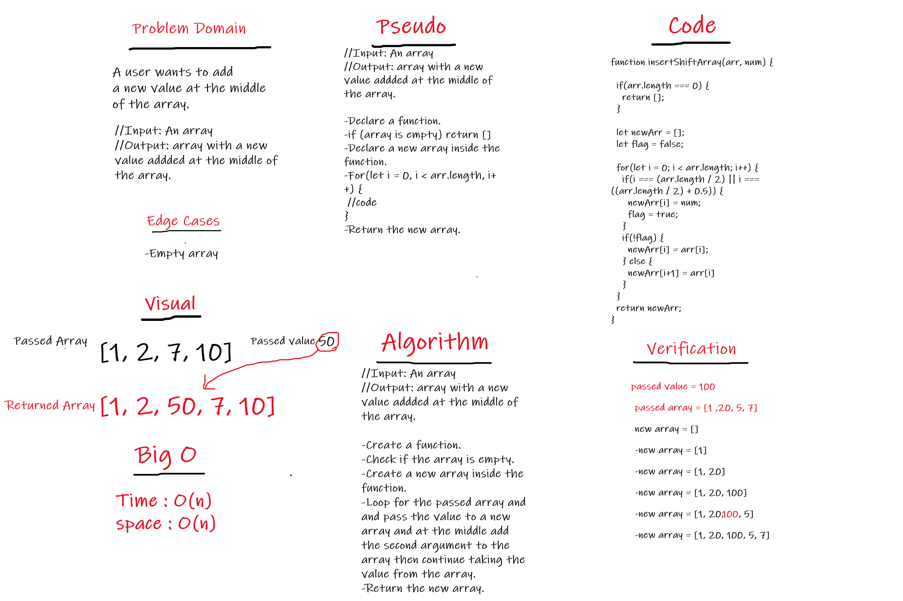

**Code_Challenge 02 // array-shift**

## White board

[array-shift Code](./app.js)

----------------------

# Challenge Summary
<!-- Short summary or background information -->
This function will add the passed value at the middle of the passed array.

## Challenge Description
<!-- Description of the challenge -->
This function will add the passed value at the middle of the passed array.

## Approach & Efficiency
<!-- What approach did you take? Why? What is the Big O space/time for this approach? -->
I used a for loop and inside it if condition., I used this approach because I wanted to not use any built in function. 

The big O:
- space: O(n)
- time: O(n)

## Solution
<!-- Embedded whiteboard image -->

