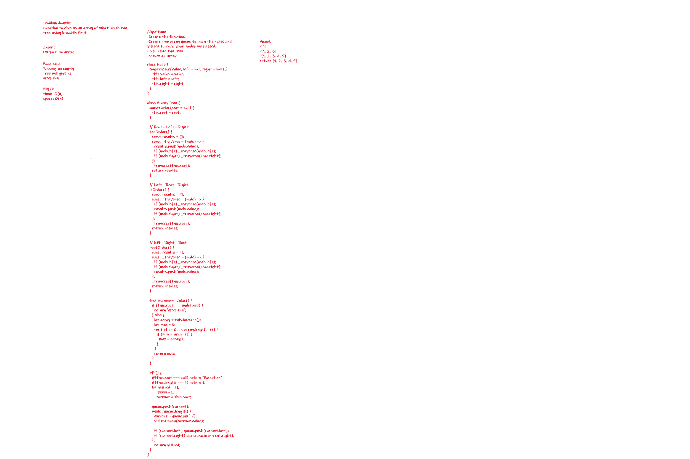

# Challenge Summary
<!-- Short summary or background information -->
Function to give what inside the tree using breadth first

## Challenge Description
<!-- Description of the challenge -->
Function to give what inside the tree using breadth first

## Approach & Efficiency
<!-- What approach did you take? Why? What is the Big O space/time for this approach? -->
Loop inside th tree and push the elements inside an array.

- Big o:
time: O(n)
space: O(n)

## Solution
<!-- Embedded whiteboard image -->
