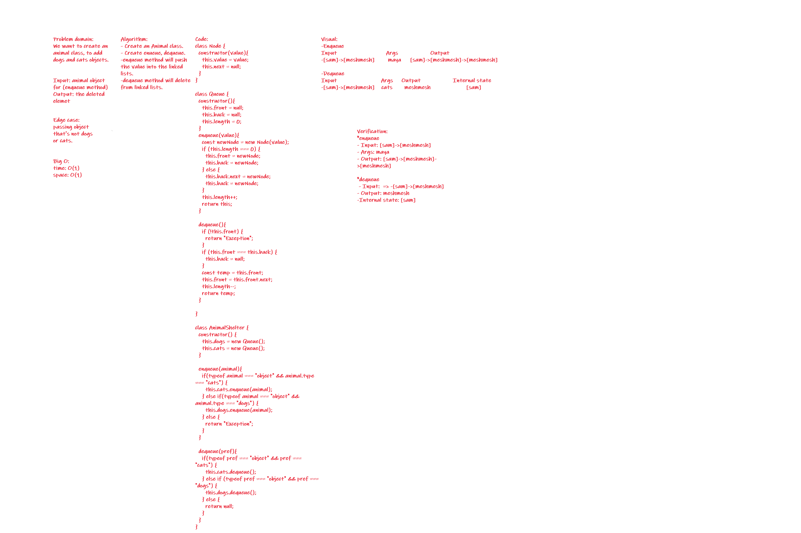

# Challenge Summary
<!-- Short summary or background information -->
Here we are creating a class and using queue to remove and add animal to it.

## Challenge Description
<!-- Description of the challenge -->
Here we are creating a class and using queue to remove and add animal to it.

## Approach & Efficiency
<!-- What approach did you take? Why? What is the Big O space/time for this approach? -->
Used a linked list with the queue data structure.

Big O:
Space: O(1)
Time: O(1)

## Solution
<!-- Embedded whiteboard image -->

