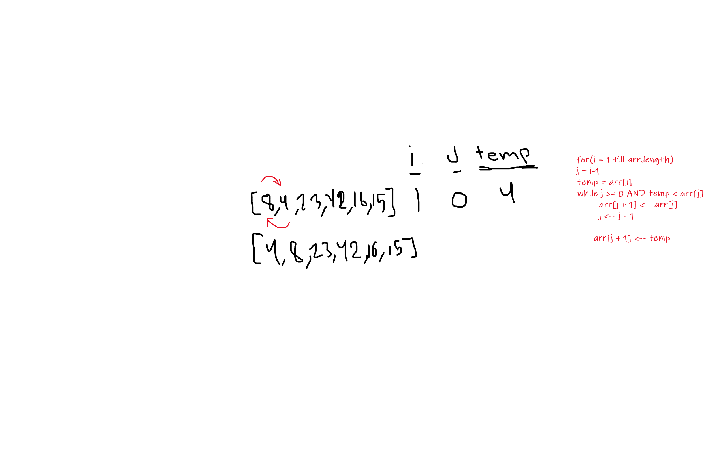
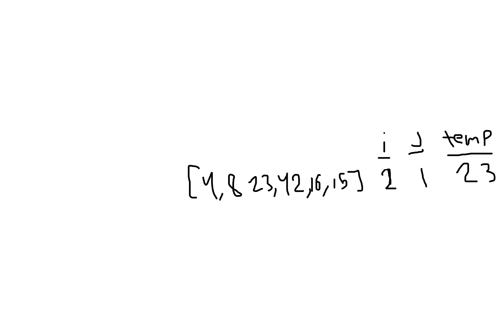
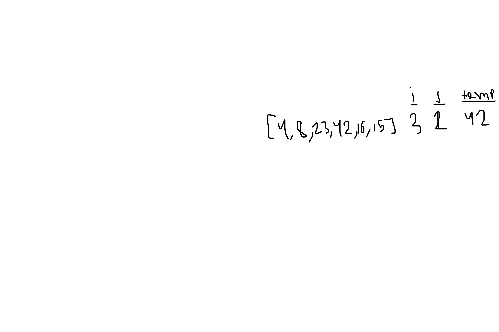
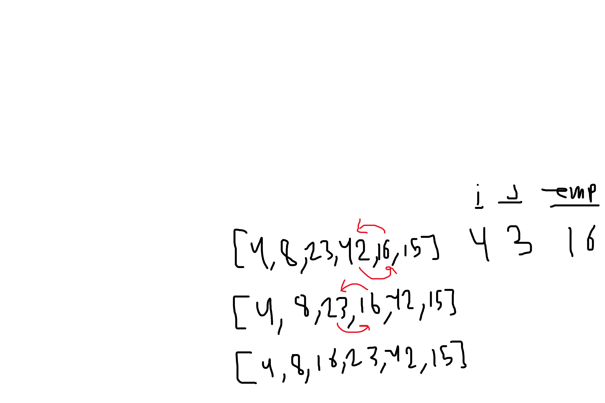
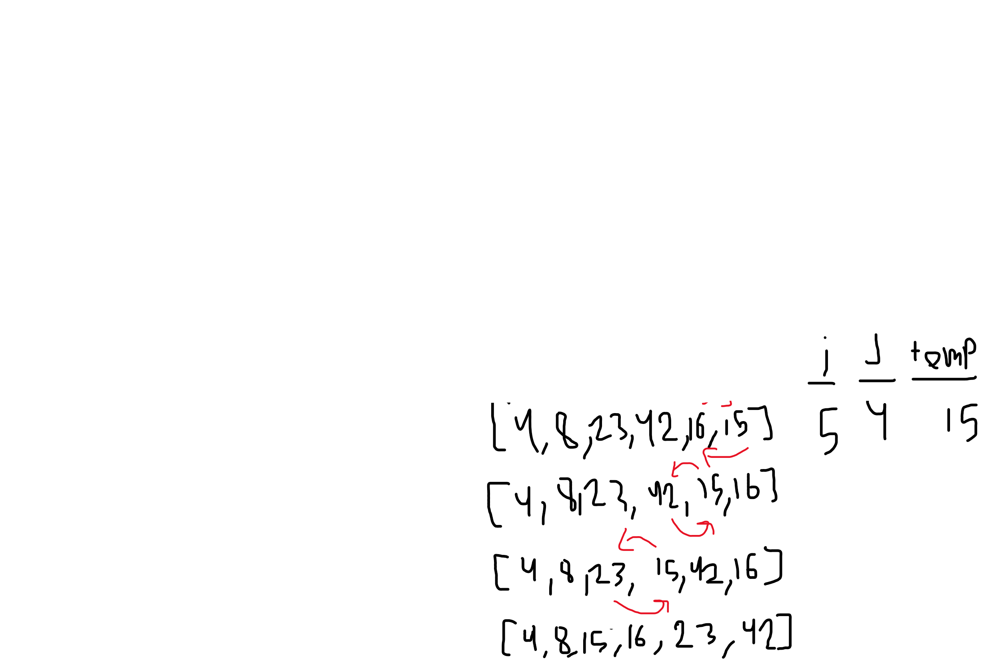

sample array : [8,4,23,42,16,15]

### Pass 1:

In the first pass we check between the first element and the second element, '8' and '4', we check if the second element is less than the first element, if it's true, the second element will be in place of the first element.

### Pass 2:

In the second pass we check between the second element and the third element, '8' and '23', we check if the third element is less than the second element, if it's true, the second element will be in place of the thirds element.

### Pass 3:

In the third pass we check between the third element and the fourth element, '23' and '42', we check if the third element is less than the fourth element, if it's true, the third element will be in place of the fourth element.

### Pass 4:

In the third pass we check between the fourth element and the fifth element, '42' and '16', we check if the fourth element is less than the fifth element, if it's true, the fourth element will be in place of the fifth element.

### Pass 5:

check for each element if it's smaller move it before.  

