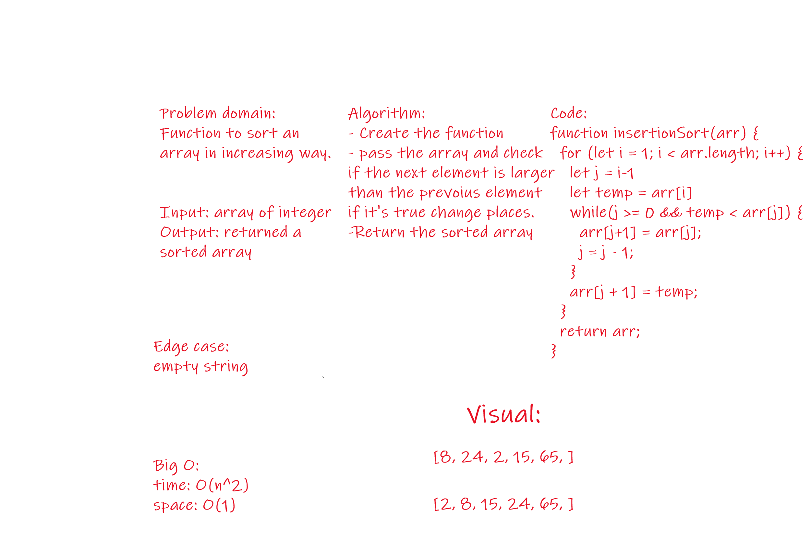

# Challenge Summary
<!-- Short summary or background information -->
This challenge describe how to sort using insertion

## Challenge Description
<!-- Description of the challenge -->
Will return a sorted array

## Approach & Efficiency
<!-- What approach did you take? Why? What is the Big O space/time for this approach? -->
using insertion sorting

Big O:
time: O(n^2)
space: O(n)

## Solution
<!-- Embedded whiteboard image -->

