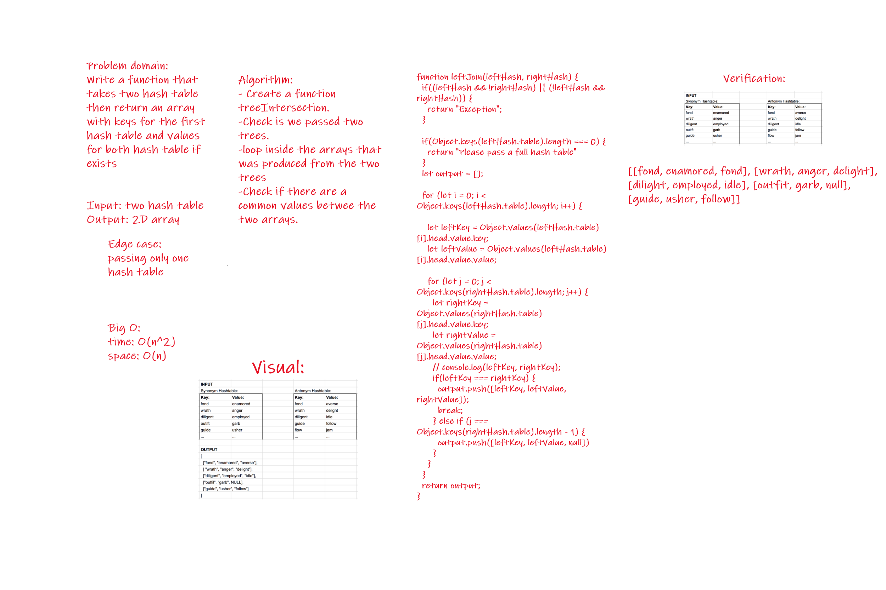

# Challenge Summary
<!-- Short summary or background information -->
This challenge describe of getting the data from two hash tables.

## Challenge Description
<!-- Description of the challenge -->
Will return an array of the keys and values.

## Approach & Efficiency
<!-- What approach did you take? Why? What is the Big O space/time for this approach? -->

Big O:
time: O(n^2)
space: O(1)

## Solution
<!-- Embedded whiteboard image -->

