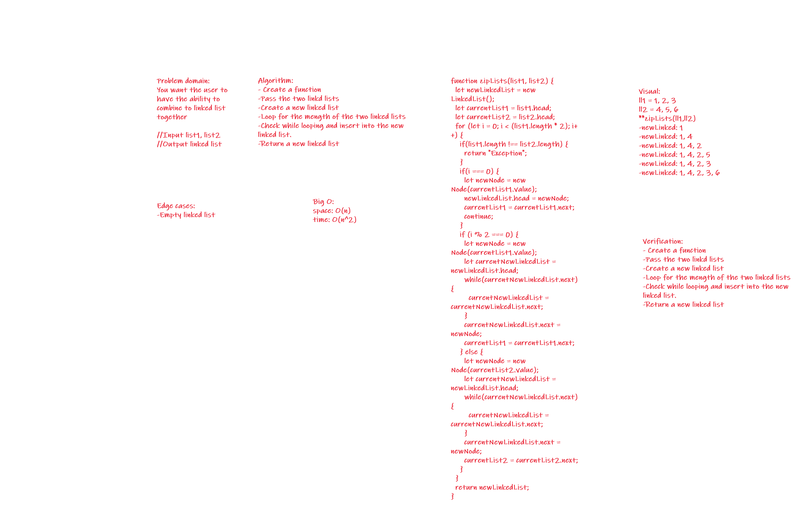

**Code_Challenge 05 // Linked-List**

[linked-list Code](./ll-zip.js)

----------------------

# Singly Linked List
<!-- Short summary or background information -->
Linked list is a type of data structure that is better than arrays.

## Challenge
<!-- Description of the challenge -->
We want the user to have the ability to create a linked list that combines two linked lists.

## Approach & Efficiency
<!-- What approach did you take? Why? What is the Big O space/time for this approach? -->

I wrote the functions then the tests. 

The big O:
- space: O(n)
- time: O(n^2)

## Solution

