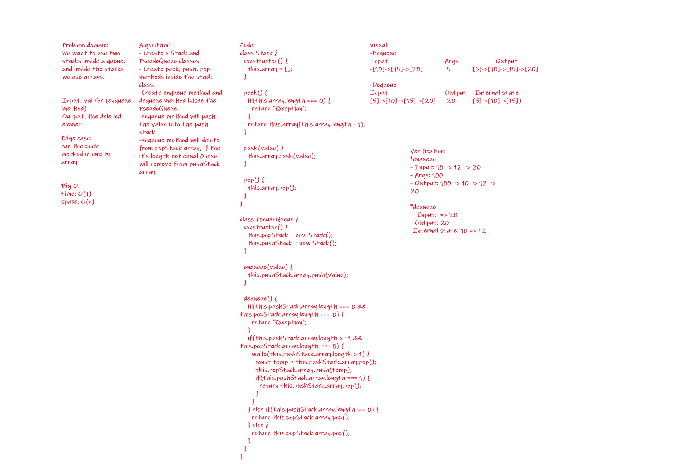

# Challenge Summary
<!-- Short summary or background information -->
Here we are using two array stacks to perform usual enqueue and dequeue methods.

## Challenge Description
<!-- Description of the challenge -->
Here we are using two array stacks to perform usual enqueue and dequeue methods.

## Approach & Efficiency
<!-- What approach did you take? Why? What is the Big O space/time for this approach? -->
Used an array as stacks and used theses stacks in the queue object.

Big O:
Space: O(n)
Time: O(1)

## Solution
<!-- Embedded whiteboard image -->

