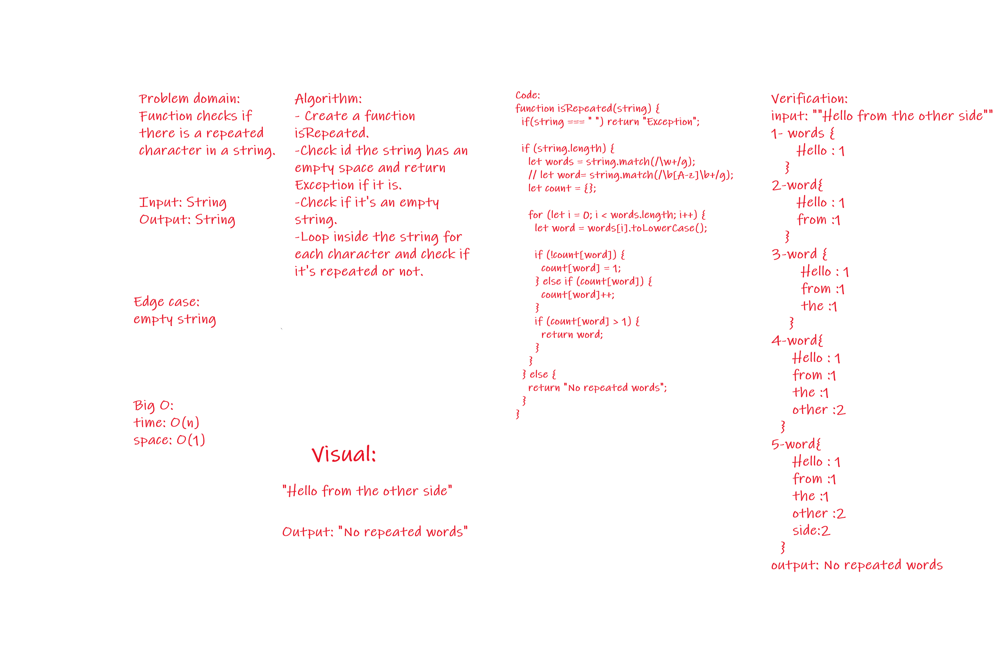

# Challenge Summary
<!-- Short summary or background information -->
This challenge describe is checking if a character is repeated.

## Challenge Description
<!-- Description of the challenge -->
Will return a repeated letter

## Approach & Efficiency
<!-- What approach did you take? Why? What is the Big O space/time for this approach? -->

Big O:
time: O(n)
space: O(1)

## Solution
<!-- Embedded whiteboard image -->

